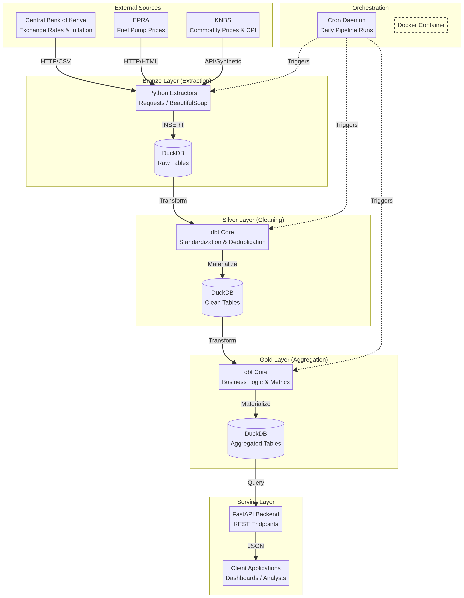
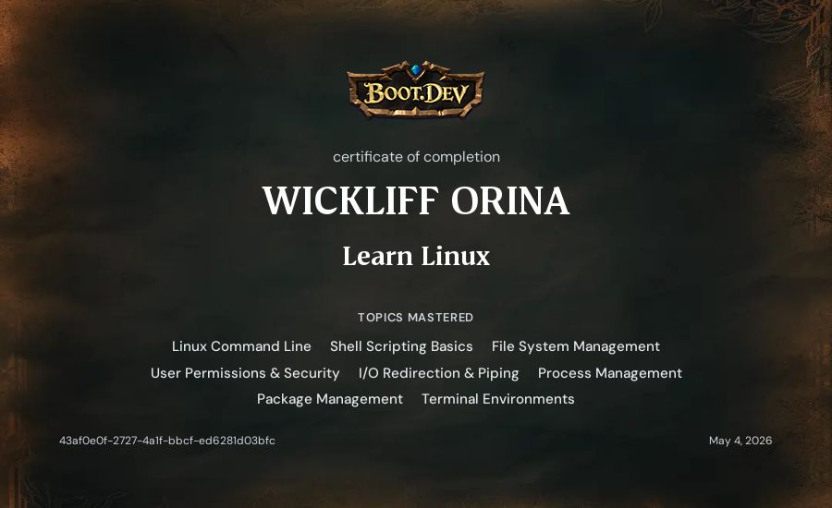

# Automated Enterprise Linux Backup System (`rsync` + `systemd`)

[](#)
[](#)
[](#)

An automated, non-disruptive Linux backup and recovery pipeline designed for server infrastructure and enterprise workloads. Built using native Bash, `rsync` incremental sync protocols, and native `systemd` timers, this project provides reliable point-in-time file versioning without external dependencies.

---

## Key Problem Solved

Traditional backup tools often introduce heavy runtime overhead, proprietary archive formats, or complex dependency chains. This project delivers a lightweight, dependency-free backup architecture that:
* Eliminates full-disk redundant copy overhead via **incremental sync**.
* Prevents silent data overwrites using **dated versioning snapshots**.
* Replaces legacy `cron` jobs with **systemd timer tracking, dependency management, and reboot persistence**.
* Captures standard execution and error channels into separate, structured log files for auditing.

---

## Architecture & System Overview

### 1. System Architecture & Setup
Demonstrates the underlying directory setup, service dependencies, and background scheduling pipeline.



### 2. Certification & Verification
Proof of system engineering practices and automated workflow implementation.



---

## Project Structure

```text
.
├── backup.sh          # Core shell script containing rsync logic & flags
├── backup.service     # Systemd unit file wrapping shell execution
├── backup.timer       # Systemd calendar timer for schedule automation
├── README.md          # System architecture and deployment guide
└── assets/            # Documentation screenshots & evidence
